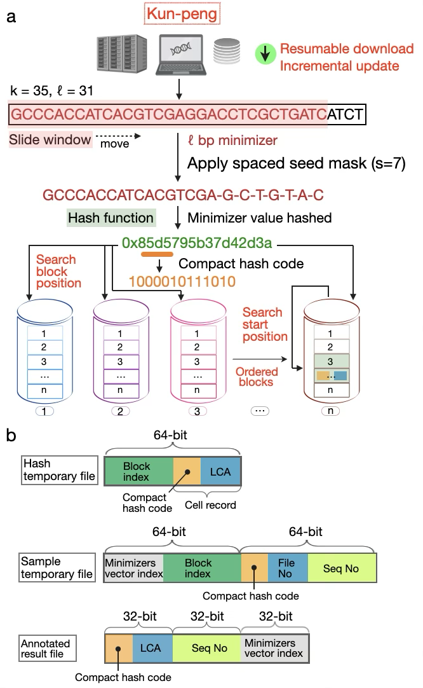
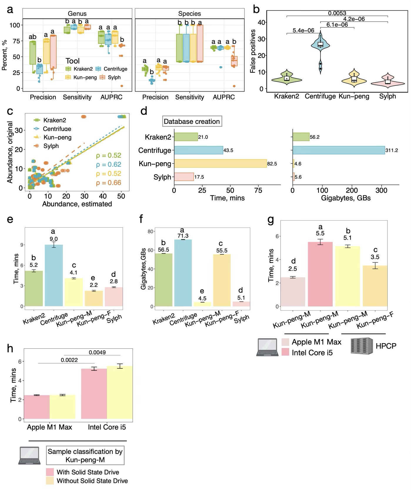

# Kun-peng  

[]() [](https://github.com/eric9n/Kun-peng/releases)

Comprehensive metagenomic sequence classification of diverse environmental samples faces significant computing memory challenges due to exponentially expanding genome databases. Here, we present Kun-peng, featuring a unique ordered 4GB block database design for ultra-efficient resource management, faster processing, and higher accuracy. When benchmarked on mock communities (Amos HiLo, Mixed, and NIST) against Kraken2, Centrifuge, and Sylph. Kun-peng matched Sylph, achieving the highest precision and lowest false-positive rates while demonstrating superior time and memory efficiency among all tested tools. Furthermore, Kun-peng's efficient database architecture enables the practical utilization of large-scale reference databases that were previously computationally prohibitive. In comprehensive testing across 586 air, water, soil, and human metagenomic samples, Kun-peng processed each sample in 0.2-11.2 minutes using only 4.0-35.4GB peak memory with an expansive pan-domain database (204,477 genomes, 4.3TB). Kun-peng classified 69.78-94.29% of reads, achieving 38-43% higher classification rates than Kraken2 with the standard database. Remarkably, Kun-peng’s processing times were comparable to Kraken2 using the standard database (81GB), roughly 5% of the size of the pan-domain database. Memory-wise, Kun-peng required only 35.4GB peak memory, representing a 473-fold reduction compared to Kraken2 (1.85TB). Unexpectedly, Sylph failed to classify any reads in air samples and left > 99.85% of reads unclassified in water and soil samples using the expansive pan-domain database. Kun-peng also processes samples up to 46.3 times faster, using up to 20.6 times less memory than Sylph. Overall, Kun-peng offers an ultra-memory-efficient, fast, and accurate solution for pan-domain metagenomic classifications.

<div style="text-align: center;">
  
  <p><strong>Fig. 1. Overview of Kun-peng's data retrieval, minimizer generation, and block-based database architecture.</strong></p>
</div>

<div style="text-align: center;">
  
  <p><strong>Fig. 2. Comprehensive performance evaluation of Kun-peng against state-of-the-art metagenomic classifiers on mock communities.</strong></p>
</div>


## Quick Start

Pick the path that matches your situation. Each path links to a detailed demo.

- Option A — Build from downloads (one command), then classify
  1) `kun_peng build --download-dir data/ --db test_database`
  2) `mkdir -p temp_chunk test_out && kun_peng classify --db test_database --chunk-dir temp_chunk --output-dir test_out data/COVID_19.fa`
  - Details: docs/build-db-demo.md and docs/classify-demo.md

- Option B — You already have or curate a library
  1) Prepare library: `kun_peng merge-fna --download-dir data/ --db test_database` or `kun_peng add-library --db test_database -i /path/to/fastas`
  2) Build-only: `kun_peng build-db --db test_database`
  3) Classify: `mkdir -p temp_chunk test_out && kun_peng classify --db test_database --chunk-dir temp_chunk --output-dir test_out <reads>`
  - Details: docs/build-db-demo.md and docs/classify-demo.md

- Option C — You have a Kraken 2 database
  1) Convert: `kun_peng hashshard --db /path/to/kraken_db --hash-capacity 1G`
  2) Classify: `mkdir -p temp_chunk test_out && kun_peng classify --db /path/to/kraken_db --chunk-dir temp_chunk --output-dir test_out <reads>`
     or direct mode: `kun_peng direct --db /path/to/kraken_db <reads>`
  - Details: [docs/hashshard-demo.md](docs/hashshard-demo.md) and [docs/classify-demo.md](docs/classify-demo.md)

For more step-by-step guidance, see:

- Detailed Database Build Demo: [docs/build-db-demo.md](docs/build-db-demo.md)
- Detailed Classification Demo: [docs/classify-demo.md](docs/classify-demo.md)
- Kraken 2 Conversion Demo: [docs/hashshard-demo.md](docs/hashshard-demo.md)


## Get Started

Follow these steps to install Kun-peng and run the examples.

If you only need commands to run today, start with Quick Start above. The sections below cover installation methods and reference help for each subcommand.

## Common Pitfalls

- Use a clean `--chunk-dir` for `classify`. The directory must not contain `sample_*.k2`, `sample_id*.map`, or `sample_*.bin`, otherwise the command will error.
- After adding FASTA with `add-library`, always run `build-db` to rebuild hash tables. Stale `hash_*.k2d` will yield incorrect results.
- Direct mode needs RAM ≥ sum of `hash_*.k2d`. Run `bash cal_memory.sh <db>` to estimate. If insufficient, use the integrated `classify` workflow instead.
- `hashshard` aborts if `hash_config.k2d` already exists in the target directory. Use a fresh directory or remove/backup the existing file.
- Choosing `--hash-capacity` (hashshard): shard file size ≈ capacity × 4 bytes. Example: `1G` capacity → ~4 GiB per shard. More, smaller shards can improve I/O parallelism with modest file count overhead.
- Keep `--load-factor` reasonable (default 0.7). Very high values may hurt build success or classification speed; very low values waste disk/memory.

### Method 1: Download Pre-built Binaries (Recommended)

If you prefer not to build from source, you can download the pre-built binaries for your platform from the GitHub [releases page](https://github.com/eric9n/Kun-peng/releases).

For Linux users (CentOS 7 compatible):

```bash
# Replace X.Y.Z with the latest version number
VERSION=vX.Y.Z
mkdir kun_peng_$VERSION
wget https://github.com/eric9n/Kun-peng/releases/download/$VERSION/kun_peng-$VERSION-centos7
# For linux x86_64
# wget https://github.com/eric9n/Kun-peng/releases/download/$VERSION/kun_peng-$VERSION-x86_64-unknown-linux-gnu
mv kun_peng-$VERSION-centos7 kun_peng_$VERSION/kun_peng
chmod +x kun_peng_$VERSION/kun_peng
# Add to PATH
echo "export PATH=\$PATH:$PWD/kun_peng_$VERSION" >> ~/.bashrc
source ~/.bashrc
```

For macOS users:

### Homebrew
```bash
brew install eric9n/tap/kun_peng
```

### Binary

```bash
# Replace X.Y.Z with the latest version number
VERSION=vX.Y.Z
mkdir kun_peng_$VERSION
# For Intel Macs
wget https://github.com/eric9n/Kun-peng/releases/download/$VERSION/kun_peng-$VERSION-x86_64-apple-darwin
mv kun_peng-$VERSION-x86_64-apple-darwin kun_peng_$VERSION/kun_peng
# For Apple Silicon Macs
# wget https://github.com/eric9n/Kun-peng/releases/download/$VERSION/kun_peng-$VERSION-aarch64-apple-darwin
# mv kun_peng-$VERSION-aarch64-apple-darwin kun_peng_$VERSION/kun_peng
chmod +x kun_peng_$VERSION/kun_peng
# Add to PATH
echo "export PATH=\$PATH:$PWD/kun_peng_$VERSION" >> ~/.zshrc  # or ~/.bash_profile for Bash
source ~/.zshrc  # or source ~/.bash_profile for Bash
```

For Windows users:

```powershell
# Replace X.Y.Z with the latest version number
$VERSION = "vX.Y.Z"
New-Item -ItemType Directory -Force -Path kun_peng_$VERSION
Invoke-WebRequest -Uri "https://github.com/eric9n/Kun-peng/releases/download/$VERSION/kun_peng-$VERSION-x86_64-pc-windows-msvc.exe" -OutFile "kun_peng_$VERSION\kun_peng.exe"
# Add to PATH
$env:Path += ";$PWD\kun_peng_$VERSION"
[Environment]::SetEnvironmentVariable("Path", $env:Path, [EnvironmentVariableTarget]::User)
```

After installation, you can verify the installation by running:

```bash
kun_peng --version
```

#### Run the `kun_peng` example

We will use a very small virus database on the GitHub homepage as an example:

1.  clone the repository

``` sh
git clone https://github.com/eric9n/Kun-peng.git
cd Kun-peng
```

2.  build database

``` sh
kun_peng build --download-dir data/ --db test_database
```

```
merge fna start...
merge fna took: 29.998258ms
estimate start...
estimate count: 14080, required capacity: 31818.0, Estimated hash table requirement: 124.29KB
convert fna file "test_database/library.fna"
process chunk file 1/1: duration: 29.326627ms
build k2 db took: 30.847894ms
```

3.  classify

``` sh
# temp_chunk is used to store intermediate files
mkdir temp_chunk
# test_out is used to store output files
mkdir test_out
kun_peng classify --db test_database --chunk-dir temp_chunk --output-dir test_out data/COVID_19.fa
```

## Development

Set up the repository's Git hooks so pushing requires an up-to-date `Cargo.lock`:

```bash
git config core.hooksPath .githooks
```

The provided `pre-push` hook runs `cargo check --locked` and aborts the push if the lock file is out of sync with `Cargo.toml`.

```
hash_config HashConfig { value_mask: 31, value_bits: 5, capacity: 31818, size: 13051, hash_capacity: 1073741824 }
splitr start...
splitr took: 18.212452ms
annotate start...
chunk_file "temp_chunk/sample_1.k2"
load table took: 548.911µs
annotate took: 12.006329ms
resolve start...
resolve took: 39.571515ms
Classify took: 92.519365ms
```

### Method 2: Clone the Repository and Build the project

#### Prerequisites

1.  **Rust**: This project requires the Rust programming environment if you plan to build from source.

#### Build the Projects

First, clone this repository to your local machine:

``` sh
git clone https://github.com/eric9n/Kun-peng.git
cd kun_peng
```

Ensure that both projects are built. You can do this by running the following command from the root of the workspace:

``` sh
cargo build --release
```

This will build the kr2r and ncbi project in release mode.

#### Run the `kun_peng` example

Next, run the example script that demonstrates how to use the `kun_peng` binary. Execute the following command from the root of the workspace:

``` sh
cargo run --release --example build_and_classify
```

This will run the build_and_classify.rs example located in the kr2r project's examples directory.

Example Output You should see output similar to the following:

``` txt
Executing command: /path/to/workspace/target/release/kun_peng build --download-dir data/ --db test_database
kun_peng build output: [build output here]
kun_peng build error: [any build errors here]

Executing command: /path/to/workspace/target/release/kun_peng direct --db test_database data/COVID_19.fa
kun_peng direct output: [direct output here]
kun_peng direct error: [any direct errors here]
```

This output confirms that the `kun_peng` commands were executed successfully and the files were processed as expected.

## ncbi_dl tool

For detailed information and usage instructions for the ncbi_dl tool, please refer to the [ncbi_dl repository](https://github.com/eric9n/ncbi_dl.git).

The ncbi_dl tool is used to download resources from the NCBI website, including taxonomy files and genome data. It provides a convenient way to obtain the necessary data for building Kun-peng databases.

### Downloading Genome Databases

To download genome databases using ncbi_dl, you can use the `genomes` (or `gen`) command. Here's a basic example:

```sh
ncbi_dl -d /path/to/download/directory gen -g bacteria
```

This command will download bacterial genomes to the specified directory. You can replace `bacteria` with other genome groups like `archaea`, `fungi`, `protozoa`, or `viral` depending on your needs.

Some key options for the `genomes` command include:

- `-g, --groups <GROUPS>`: Specify which genome groups to download (e.g., bacteria, archaea, viral)
- `-f, --file-types <FILE_TYPES>`: Choose which file types to download (default is genomic.fna.gz)
- `-l, --assembly-level <ASSEMBLY_LEVEL>`: Set the assembly level (e.g., complete, chromosome, scaffold, contig)

For a full list of options and more detailed usage instructions, please refer to the ncbi_dl repository documentation.

For installation, additional usage examples, and more detailed documentation, please visit the ncbi_dl repository linked above.

## kun_peng

``` sh
Usage: kun_peng <COMMAND>

Commands:
  estimate   estimate capacity
  build      build `k2d` files
  build-db   Run the final database construction steps (estimate, chunk, build)
  add-library Add new FASTA files to an existing Kun-Peng database library
  hashshard  Convert Kraken2 database files to Kun-peng database format for efficient processing and analysis.
  splitr     Split fast(q/a) file into ranges
  annotate   annotate a set of sequences
  resolve    resolve taxonomy tree
  classify   Integrates 'splitr', 'annotate', and 'resolve' into a unified workflow for sequence classification. classify a set of sequences
  direct     Directly load all hash tables for classification annotation
  merge-fna  A tool for processing genomic files
  help       Print this message or the help of the given subcommand(s)

Options:
  -h, --help     Print help
  -V, --version  Print version
```

### build database

Build the kun_peng database like Kraken2, specifying the directory for the data files downloaded from NCBI, as well as the database directory.

``` sh
./target/release/kun_peng build -h
build database

Usage: kun_peng build [OPTIONS] --download-dir <DOWNLOAD_DIR> --db <DATABASE>

Options:
  -d, --download-dir <DOWNLOAD_DIR>
          Directory to store downloaded files
      --db <DATABASE>
          ncbi library fna database directory
  -k, --k-mer <K_MER>
          Set length of k-mers, k must be positive integer, k=35, k cannot be less than l [default: 35]
  -l, --l-mer <L_MER>
          Set length of minimizers, 1 <= l <= 31 [default: 31]
      --minimizer-spaces <MINIMIZER_SPACES>
          Number of characters in minimizer that are ignored in comparisons [default: 7]
  -T, --toggle-mask <TOGGLE_MASK>
          Minimizer ordering toggle mask [default: 16392584516609989165]
      --min-clear-hash-value <MIN_CLEAR_HASH_VALUE>

  -r, --requested-bits-for-taxid <REQUESTED_BITS_FOR_TAXID>
          Bit storage requested for taxid 0 <= r < 31 [default: 0]
  -p, --threads <THREADS>
          Number of threads [default: 10]
      --cache
          estimate capacity from cache if exists
      --max-n <MAX_N>
          Set maximum qualifying hash code [default: 4]
      --load-factor <LOAD_FACTOR>
          Proportion of the hash table to be populated (build task only; def: 0.7, must be between 0 and 1) [default: 0.7]
  -h, --help
          Print help
  -V, --version
          Print version
```

### build-db (Build Only)

Build from an existing `library/` directory. This runs the final steps only: estimate capacity (unless `-c` is provided), chunk, and build hash tables.

``` sh
./target/release/kun_peng build-db -h
Run the final database construction steps (estimate, chunk, build)

Usage: kun_peng build-db [OPTIONS] --db <DATABASE>

Options:
      --db <DATABASE>                          ncbi library fna database directory
  -k, --k-mer <K_MER>                          Set length of k-mers, k must be positive integer, k cannot be less than l [default: 35]
  -l, --l-mer <L_MER>                          Set length of minimizers, 1 <= l <= 31 [default: 31]
      --minimizer-spaces <MINIMIZER_SPACES>    Number of characters in minimizer that are ignored in comparisons [default: 7]
  -T, --toggle-mask <TOGGLE_MASK>              Minimizer ordering toggle mask [default: 16392584516609989165]
      --min-clear-hash-value <MIN_CLEAR_HASH_VALUE>
  -r, --requested-bits-for-taxid <REQUESTED_BITS_FOR_TAXID>
                                               Bit storage requested for taxid 0 <= r < 31 [default: 0]
  -p, --threads <THREADS>                      Number of threads [default: 8]
  -c, --required-capacity <EXACT_SLOT_COUNT>   Manually set the precise hash table capacity (number of slots)
      --cache                                  Estimate capacity from cache if exists
      --max-n <MAX_N>                          Set maximum qualifying hash code [default: 4]
      --load-factor <LOAD_FACTOR>              Proportion of the hash table to be populated [default: 0.7]
  -h, --help                                   Print help
  -V, --version                                Print version
```

Note: If you already have a populated `library/` under your database directory (e.g., after running `merge-fna` or manually preparing it), prefer:

``` sh
kun_peng build-db --db test_database
```

Example: Prepare library, then build-db

``` sh
# 1) Merge downloaded genomes into library files
kun_peng merge-fna --download-dir data/ --db test_database --max-file-size 2G

# 2) Build only the final database artifacts (estimate, chunk, build)
kun_peng build-db --db test_database
```

### add-library (Add FASTA)

Add new FASTA files (or directories of FASTA/FASTA.GZ) into an existing database. This updates `library/*.fna` sharded files and appends new entries to `seqid2taxid.map`. After adding, run `build-db` to rebuild hash tables.

``` sh
./target/release/kun_peng add-library -h
Add new FASTA files to an existing Kun-Peng database library

Usage: kun_peng add-library [OPTIONS] --db <DATABASE> --input-library <INPUT_LIBRARY>...

Options:
      --db <DATABASE>                          Main database directory (must contain existing library/ and taxonomy/ dirs)
  -i, --input-library <INPUT_LIBRARY>...       Input files or directories (containing .fa, .fna, .fasta, .fsa, *.gz files)
      --max-file-size <MAX_FILE_SIZE>          library fna temp file max size [default: 2G]
  -h, --help                                   Print help
  -V, --version                                Print version
```

Quick example:

``` sh
# Add a folder of FASTA files into an existing database
kun_peng add-library --db test_database -i /path/to/new_fastas/

# Rebuild index after adding
kun_peng build-db --db test_database
```

### Convert Kraken2 database

Converts an existing Kraken 2 database (containing `hash.k2d`, `opts.k2d`, and `taxo.k2d`) into Kun-peng’s sharded hash format. This enables Kun-peng’s memory- and I/O-efficient classification workflows without rebuilding from source FASTA.

See step-by-step demo: docs/hashshard-demo.md

```sh
./target/release/kun_peng hashshard -h
Convert Kraken2 database files to Kun-peng database format for efficient processing and analysis.

Usage: kun_peng hashshard [OPTIONS] --db <DATABASE>

Options:
      --db <DATABASE>                  The database directory for the Kraken 2 index. contains index files(hash.k2d opts.k2d taxo.k2d)
      --hash-capacity <HASH_CAPACITY>  Specifies the hash file capacity.
                                       Acceptable formats include numeric values followed by 'K', 'M', or 'G' (e.g., '1.5G', '250M', '1024K').
                                       Note: The specified capacity affects the index size, with a factor of 4 applied.
                                       For example, specifying '1G' results in an index size of '4G'.
                                       Default: 1G (capacity 1G = file size 4G) [default: 1G]
  -h, --help                           Print help
  -V, --version                        Print version

```


### classify

The classification process is divided into three modes:

1.  Direct Processing Mode:

-   Description: In this mode, all database files are loaded simultaneously, which requires a significant amount of memory. Before running this mode, you need to check the total size of hash\_\*.k2d files in the database directory using the provided script. Ensure that your available memory meets or exceeds this size.

``` sh
bash cal_memory.sh $database_dir
```

-   Characteristics:
    -   High memory requirements
    -   Fast performance

Command Help

``` sh
./target/release/kun_peng direct -h
Directly load all hash tables for classification annotation

Usage: kun_peng direct [OPTIONS] --db <DATABASE> [INPUT_FILES]...

Arguments:
  [INPUT_FILES]...  A list of input file paths (FASTA/FASTQ) to be processed by the classify program. Supports fasta or fastq format files (e.g., .fasta, .fastq) and gzip compressed files (e.g., .fasta.gz, .fastq.gz)

Options:
      --db <DATABASE>
          database hash chunk directory and other files
  -P, --paired-end-processing
          Enable paired-end processing
  -Q, --minimum-quality-score <MINIMUM_QUALITY_SCORE>
          Minimum quality score for FASTQ data [default: 0]
  -T, --confidence-threshold <CONFIDENCE_THRESHOLD>
          Confidence score threshold [default: 0]
  -K, --report-kmer-data
          In comb. w/ -R, provide minimizer information in report
  -z, --report-zero-counts
          In comb. w/ -R, report taxa w/ 0 count
  -g, --minimum-hit-groups <MINIMUM_HIT_GROUPS>
          The minimum number of hit groups needed for a call [default: 2]
  -p, --num-threads <NUM_THREADS>
          The number of threads to use [default: 10]
      --output-dir <KRAKEN_OUTPUT_DIR>
          File path for outputting normal Kraken output
  -h, --help
          Print help (see more with '--help')
  -V, --version
          Print version
```

2.  Chunk Processing Mode:

-   Description: This mode processes the sample data in chunks, loading only a small portion of the database files at a time. This reduces the memory requirements, needing a minimum of 4GB of memory plus the size of one pair of sample files.
-   Characteristics:
    -   Low memory consumption
    -   Slower performance compared to Direct Processing Mode

Command Help

``` sh
./target/release/kun_peng classify -h
Integrates 'splitr', 'annotate', and 'resolve' into a unified workflow for sequence classification. classify a set of sequences

Usage: kun_peng classify [OPTIONS] --db <DATABASE> --chunk-dir <CHUNK_DIR> [INPUT_FILES]...

Arguments:
  [INPUT_FILES]...  A list of input file paths (FASTA/FASTQ) to be processed by the classify program. Supports fasta or fastq format files (e.g., .fasta, .fastq) and gzip compressed files (e.g., .fasta.gz, .fastq.gz).
  Can also be a single .txt file containing a list of input file paths, one per line.

Options:
      --db <DATABASE>

      --chunk-dir <CHUNK_DIR>
          chunk directory
      --output-dir <KRAKEN_OUTPUT_DIR>
          File path for outputting normal Kraken output
  -P, --paired-end-processing
          Enable paired-end processing
  -Q, --minimum-quality-score <MINIMUM_QUALITY_SCORE>
          Minimum quality score for FASTQ data [default: 0]
  -p, --num-threads <NUM_THREADS>
          The number of threads to use [default: 10]
     --buffer-size <BUFFER_SIZE>
          [default: 16777216]
      --batch-size <BATCH_SIZE>
          The size of each batch for processing taxid match results, used to control memory usage
          [default: 16]
  -T, --confidence-threshold <CONFIDENCE_THRESHOLD>
          Confidence score threshold [default: 0]
  -g, --minimum-hit-groups <MINIMUM_HIT_GROUPS>
          The minimum number of hit groups needed for a call [default: 2]
      --kraken-db-type
          Enables use of a Kraken 2 compatible shared database
  -K, --report-kmer-data
          In comb. w/ -R, provide minimizer information in report
  -z, --report-zero-counts
          In comb. w/ -R, report taxa w/ 0 count
  -h, --help
          Print help (see more with '--help')
  -V, --version
          Print version
```

3.  Step-by-Step Processing Mode:

-   Description: This mode breaks down the chunk processing mode into individual steps, providing greater flexibility in managing the entire classification process.
-   Characteristics:
    -   Flexible processing steps
    -   Similar memory consumption to Chunk Processing Mode
    -   Performance varies based on execution steps

### Output

-   test_out/output_1.txt：

Standard Kraken Output Format:

1.  "C"/"U": a one letter code indicating that the sequence was either classified or unclassified.
2.  The sequence ID, obtained from the FASTA/FASTQ header.
3.  The taxonomy ID Kraken 2 used to label the sequence; this is 0 if the sequence is unclassified.
4.  The length of the sequence in bp. In the case of paired read data, this will be a string containing the lengths of the two sequences in bp, separated by a pipe character, e.g. "98\|94".
5.  A space-delimited list indicating the LCA mapping of each k-mer in the sequence(s). For example, "562:13 561:4 A:31 0:1 562:3" would indicate that:
    -   the first 13 k-mers mapped to taxonomy ID #562
    -   the next 4 k-mers mapped to taxonomy ID #561
    -   the next 31 k-mers contained an ambiguous nucleotide
    -   the next k-mer was not in the database
    -   the last 3 k-mers mapped to taxonomy ID #562
    Note that paired read data will contain a "`|:|`" token in this list to indicate the end of one read and the beginning of another.

-   test_out/output_1.kreport2：

```
100.00  1   0   R   1   root
100.00  1   0   D   10239     Viruses
100.00  1   0   D1  2559587     Riboviria
100.00  1   0   O   76804         Nidovirales
100.00  1   0   O1  2499399         Cornidovirineae
100.00  1   0   F   11118             Coronaviridae
100.00  1   0   F1  2501931             Orthocoronavirinae
100.00  1   0   G   694002                Betacoronavirus
100.00  1   0   G1  2509511                 Sarbecovirus
100.00  1   0   S   694009                    Severe acute respiratory syndrome-related coronavirus
100.00  1   1   S1  2697049                     Severe acute respiratory syndrome coronavirus 2
```

Sample Report Output Formats:

1.  Percentage of fragments covered by the clade rooted at this taxon
2.  Number of fragments covered by the clade rooted at this taxon
3.  Number of fragments assigned directly to this taxon
4.  A rank code, indicating (U)nclassified, (R)oot, (D)omain, (K)ingdom, (P)hylum, (C)lass, (O)rder, (F)amily, (G)enus, or (S)pecies. Taxa that are not at any of these 10 ranks have a rank code that is formed by using the rank code of the closest ancestor rank with a number indicating the distance from that rank. E.g., "G2" is a rank code indicating a taxon is between genus and species and the grandparent taxon is at the genus rank.
5.  NCBI taxonomic ID number
6.  Indented scientific name


### Citation
```bibtex
@article{Chen2024KunPeng,
  author = {Chen, Qiong and Zhang, Boliang and Peng, Chen and Huang, Jiajun and Shen, Xiaotao and Jiang, Chao},
  title = {Kun-peng: an ultra-memory-efficient, fast, and accurate pan-domain taxonomic classifier for all},
  journal = {bioRxiv},
  year = {2024},
  doi = {10.1101/2024.12.19.629356},
  url = {https://www.biorxiv.org/content/10.1101/2024.12.19.629356v1},
  note = {preprint}
}
```
