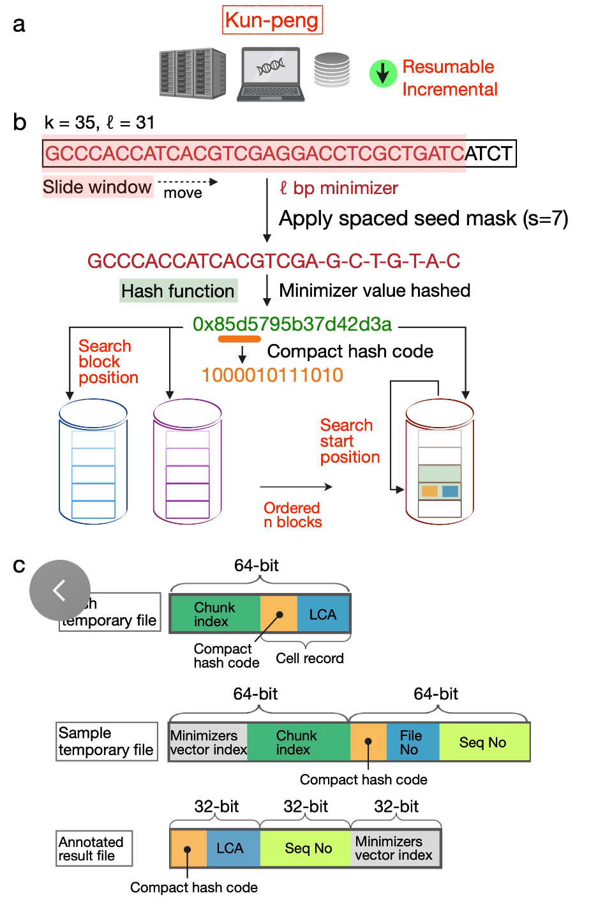

# Kun-peng 

[]() [](https://github.com/eric9n/Kun-peng/releases)

We developed Kun-peng, an accurate and highly scalable low-memory tool for classifying metagenomic sequences.

Comprehensive metagenomic sequence classification of diverse environmental samples faces significant computing memory challenges due to exponentially expanding genome databases. Inspired by Kraken2, we developed Kun-peng to classify metagenomic data with ultra-efficient resource management algorithms, faster processing, and higher accuracy. Specifically, Kun-peng divides the reference database into ordered 4GB blocks when building and querying the index. Kun-peng offers two classification modes: Memory-Efficient (Kun-peng-M) and Full-Speed (Kun-peng-F). Kun-peng-M requires only a few percentages of Kraken2’s memory to classify metagenomic data with comparable speed. Kun-peng-F loads all blocks of databases simultaneously for faster speed. For a reference database of 42,485 genomes (123G), Kun-peng-M uses only 4.5 ± 0.11 GB of memory, or 7.96 ± 0.19 % of that of Kraken2, while achieving 16.9 ± 10.0 % fewer false positives at the genus level. Kun-Peng-F requires only 67.2 ± 4.57 % of Kraken2’s processing time. Furthermore, Kun-peng’s unique database design allows the utilization of large-scale reference databases, which were impractical to use with Kraken2. For a 1.85TB database, Kun-peng required only 1.95% of the peak memory required by Kraken2 and dramatically increased the classification rates for complex samples from diverse environments, including air, water, soil, and various human body sites. In summary, Kun-peng offers an ultra-memory-efficient, fast, and accurate solution for pan-domain metagenomic classifications.


The name "Kun-peng" is a massive mythical creature capable of transforming from a giant fish in the water (Kun) to a giant bird in the sky (Peng) from Chinese mythology, reflecting the flexible nature and capacity of the software to efficiently navigate the vast and complex landscapes of metagenomic data.



## Get Started

Follow these steps to install Kun-peng and run the examples.

### Method 1: Download Pre-built Binaries (Recommended)

If you prefer not to build from source, you can download the pre-built binaries for your platform from the GitHub [releases page](https://github.com/eric9n/Kun-peng/releases).

```bash
mkdir kun_peng_v0.6.10
tar -xvf Kun-peng-v0.6.10-centos7.tar.gz -C kun_peng_v0.6.10
# Add environment variable
echo 'export PATH=$PATH:~/biosoft/kun_peng_v0.6.10' >> ~/.bashrc
source ~/.bashrc
```

#### Run the `kun_peng` example

We will use a very small virus database on the GitHub homepage as an example:

1.  clone the repository

``` sh
git clone https://github.com/eric9n/Kun-peng.git
cd Kun-peng
```

2.  build database

``` sh
kun_peng build --download-dir data/ --db test_database
```

```
merge fna start...
merge fna took: 29.998258ms
estimate start...
estimate count: 14080, required capacity: 31818.0, Estimated hash table requirement: 124.29KB
convert fna file "test_database/library.fna"
process chunk file 1/1: duration: 29.326627ms
build k2 db took: 30.847894ms
```

3.  classify

``` sh
# temp_chunk is used to store intermediate files
mkdir temp_chunk
# test_out is used to store output files
mkdir test_out
kun_peng classify --db test_database --chunk-dir temp_chunk --output-dir test_out data/COVID_19.fa
```

```
hash_config HashConfig { value_mask: 31, value_bits: 5, capacity: 31818, size: 13051, hash_capacity: 1073741824 }
splitr start...
splitr took: 18.212452ms
annotate start...
chunk_file "temp_chunk/sample_1.k2"
load table took: 548.911µs
annotate took: 12.006329ms
resolve start...
resolve took: 39.571515ms
Classify took: 92.519365ms
```

### Method 2: Clone the Repository and Build the project

#### Prerequisites

1.  **Rust**: This project requires the Rust programming environment if you plan to build from source.

#### Build the Projects

First, clone this repository to your local machine:

``` sh
git clone https://github.com/eric9n/Kun-peng.git
cd kun_peng
```

Ensure that both projects are built. You can do this by running the following command from the root of the workspace:

``` sh
cargo build --release
```

This will build the kr2r and ncbi project in release mode.

#### Run the `kun_peng` example

Next, run the example script that demonstrates how to use the `kun_peng` binary. Execute the following command from the root of the workspace:

``` sh
cargo run --release --example build_and_classify --package kr2r
```

This will run the build_and_classify.rs example located in the kr2r project's examples directory.

Example Output You should see output similar to the following:

``` txt
Executing command: /path/to/workspace/target/release/kun_peng build --download-dir data/ --db test_database
kun_peng build output: [build output here]
kun_peng build error: [any build errors here]

Executing command: /path/to/workspace/target/release/kun_peng direct --db test_database data/COVID_19.fa
kun_peng direct output: [direct output here]
kun_peng direct error: [any direct errors here]
```

This output confirms that the `kun_peng` commands were executed successfully and the files were processed as expected.

## ncbi tool


#### Run the `ncbi` Example

Run the example script in the ncbi project to download the necessary files. Execute the following command from the root of the workspace:

``` sh
cargo run --release --example run_download --package ncbi
```

This will run the run_download.rs example located in the ncbi project's examples directory. The script will:

1.  Ensure the necessary directories exist.
2.  Download the required files using the ncbi binary with the following commands:

-   ./target/release/ncbi -d downloads gen -g archaea
-   ./target/release/ncbi -d downloads tax

Example Output You should see output similar to the following:

``` txt
Executing command: /path/to/workspace/target/release/ncbi -d /path/to/workspace/downloads gen -g archaea
NCBI binary output: [download output here]

Executing command: /path/to/workspace/target/release/ncbi -d /path/to/workspace/downloads tax
NCBI binary output: [download output here]
```

The ncbi binary is used to download resources from the NCBI website. Here is the help manual for the ncbi binary:

``` sh
./target/release/ncbi -h
ncbi download resource

Usage: ncbi [OPTIONS] <COMMAND>

Commands:
  taxonomy  Download taxonomy files from NCBI (alias: tax)
  genomes   Download genomes data from NCBI (alias: gen)
  help      Print this message or the help of the given subcommand(s)

Options:
  -d, --download-dir <DOWNLOAD_DIR>  Directory to store downloaded files [default: lib]
  -n, --num-threads <NUM_THREADS>    Number of threads to use for downloading [default: 20]
  -h, --help                         Print help (see more with '--help')
  -V, --version                      Print version
```

## kun_peng tool

``` sh
Usage: kun_peng <COMMAND>

Commands:
  estimate   estimate capacity
  build      build `k2d` files
  hashshard  Convert Kraken2 database files to Kun-peng database format for efficient processing and analysis.
  splitr     Split fast(q/a) file into ranges
  annotate   annotate a set of sequences
  resolve    resolve taxonomy tree
  classify   Integrates 'splitr', 'annotate', and 'resolve' into a unified workflow for sequence classification. classify a set of sequences
  direct     Directly load all hash tables for classification annotation
  merge-fna  A tool for processing genomic files
  help       Print this message or the help of the given subcommand(s)

Options:
  -h, --help     Print help
  -V, --version  Print version
```

### build database

Build the kun_peng database like Kraken2, specifying the directory for the data files downloaded from NCBI, as well as the database directory.

``` sh
./target/release/kun_peng build -h
build database

Usage: kun_peng build [OPTIONS] --download-dir <DOWNLOAD_DIR> --db <DATABASE>

Options:
  -d, --download-dir <DOWNLOAD_DIR>
          Directory to store downloaded files
      --db <DATABASE>
          ncbi library fna database directory
  -k, --k-mer <K_MER>
          Set length of k-mers, k must be positive integer, k=35, k cannot be less than l [default: 35]
  -l, --l-mer <L_MER>
          Set length of minimizers, 1 <= l <= 31 [default: 31]
      --minimizer-spaces <MINIMIZER_SPACES>
          Number of characters in minimizer that are ignored in comparisons [default: 7]
  -T, --toggle-mask <TOGGLE_MASK>
          Minimizer ordering toggle mask [default: 16392584516609989165]
      --min-clear-hash-value <MIN_CLEAR_HASH_VALUE>

  -r, --requested-bits-for-taxid <REQUESTED_BITS_FOR_TAXID>
          Bit storage requested for taxid 0 <= r < 31 [default: 0]
  -p, --threads <THREADS>
          Number of threads [default: 10]
      --cache
          estimate capacity from cache if exists
      --max-n <MAX_N>
          Set maximum qualifying hash code [default: 4]
      --load-factor <LOAD_FACTOR>
          Proportion of the hash table to be populated (build task only; def: 0.7, must be between 0 and 1) [default: 0.7]
  -h, --help
          Print help
  -V, --version
          Print version
```

### Convert Kraken2 database

This tool converts Kraken2 database files into Kun-peng database format for more efficient processing and analysis. By specifying the database directory and the hash file capacity, users can control the size of the resulting database index files.

```sh
./target/release/kun_peng hashshard -h
Convert Kraken2 database files to Kun-peng database format for efficient processing and analysis.

Usage: kun_peng hashshard [OPTIONS] --db <DATABASE>

Options:
      --db <DATABASE>                  The database directory for the Kraken 2 index. contains index files(hash.k2d opts.k2d taxo.k2d)
      --hash-capacity <HASH_CAPACITY>  Specifies the hash file capacity.
                                       Acceptable formats include numeric values followed by 'K', 'M', or 'G' (e.g., '1.5G', '250M', '1024K').
                                       Note: The specified capacity affects the index size, with a factor of 4 applied.
                                       For example, specifying '1G' results in an index size of '4G'.
                                       Default: 1G (capacity 1G = file size 4G) [default: 1G]
  -h, --help                           Print help
  -V, --version                        Print version

```


### classify

The classification process is divided into three modes:

1.  Direct Processing Mode:

-   Description: In this mode, all database files are loaded simultaneously, which requires a significant amount of memory. Before running this mode, you need to check the total size of hash\_\*.k2d files in the database directory using the provided script. Ensure that your available memory meets or exceeds this size.

``` sh
bash cal_memory.sh $database_dir
```

-   Characteristics:
    -   High memory requirements
    -   Fast performance

Command Help

``` sh
./target/release/kun_peng direct -h
Directly load all hash tables for classification annotation

Usage: kun_peng direct [OPTIONS] --db <DATABASE> [INPUT_FILES]...

Arguments:
  [INPUT_FILES]...  A list of input file paths (FASTA/FASTQ) to be processed by the classify program. Supports fasta or fastq format files (e.g., .fasta, .fastq) and gzip compressed files (e.g., .fasta.gz, .fastq.gz)

Options:
      --db <DATABASE>
          database hash chunk directory and other files
  -P, --paired-end-processing
          Enable paired-end processing
  -S, --single-file-pairs
          Process pairs with mates in the same file
  -Q, --minimum-quality-score <MINIMUM_QUALITY_SCORE>
          Minimum quality score for FASTQ data [default: 0]
  -T, --confidence-threshold <CONFIDENCE_THRESHOLD>
          Confidence score threshold [default: 0]
  -K, --report-kmer-data
          In comb. w/ -R, provide minimizer information in report
  -z, --report-zero-counts
          In comb. w/ -R, report taxa w/ 0 count
  -g, --minimum-hit-groups <MINIMUM_HIT_GROUPS>
          The minimum number of hit groups needed for a call [default: 2]
  -p, --num-threads <NUM_THREADS>
          The number of threads to use [default: 10]
      --output-dir <KRAKEN_OUTPUT_DIR>
          File path for outputting normal Kraken output
  -h, --help
          Print help (see more with '--help')
  -V, --version
          Print version
```

2.  Chunk Processing Mode:

-   Description: This mode processes the sample data in chunks, loading only a small portion of the database files at a time. This reduces the memory requirements, needing a minimum of 4GB of memory plus the size of one pair of sample files.
-   Characteristics:
    -   Low memory consumption
    -   Slower performance compared to Direct Processing Mode

Command Help

``` sh
./target/release/kun_peng classify -h
Integrates 'splitr', 'annotate', and 'resolve' into a unified workflow for sequence classification. classify a set of sequences

Usage: kun_peng classify [OPTIONS] --db <DATABASE> --chunk-dir <CHUNK_DIR> [INPUT_FILES]...

Arguments:
  [INPUT_FILES]...  A list of input file paths (FASTA/FASTQ) to be processed by the classify program. Supports fasta or fastq format files (e.g., .fasta, .fastq) and gzip compressed files (e.g., .fasta.gz, .fastq.gz)

Options:
      --db <DATABASE>

      --chunk-dir <CHUNK_DIR>
          chunk directory
      --output-dir <KRAKEN_OUTPUT_DIR>
          File path for outputting normal Kraken output
  -P, --paired-end-processing
          Enable paired-end processing
  -S, --single-file-pairs
          Process pairs with mates in the same file
  -Q, --minimum-quality-score <MINIMUM_QUALITY_SCORE>
          Minimum quality score for FASTQ data [default: 0]
  -p, --num-threads <NUM_THREADS>
          The number of threads to use [default: 10]
     --buffer-size <BUFFER_SIZE>
          [default: 16777216]
      --batch-size <BATCH_SIZE>
          The size of each batch for processing taxid match results, used to control memory usage
          [default: 16]
  -T, --confidence-threshold <CONFIDENCE_THRESHOLD>
          Confidence score threshold [default: 0]
  -g, --minimum-hit-groups <MINIMUM_HIT_GROUPS>
          The minimum number of hit groups needed for a call [default: 2]
      --kraken-db-type
          Enables use of a Kraken 2 compatible shared database
  -K, --report-kmer-data
          In comb. w/ -R, provide minimizer information in report
  -z, --report-zero-counts
          In comb. w/ -R, report taxa w/ 0 count
  -h, --help
          Print help (see more with '--help')
  -V, --version
          Print version
```

3.  Step-by-Step Processing Mode:

-   Description: This mode breaks down the chunk processing mode into individual steps, providing greater flexibility in managing the entire classification process.
-   Characteristics:
    -   Flexible processing steps
    -   Similar memory consumption to Chunk Processing Mode
    -   Performance varies based on execution steps

### Output

-   test_out/output_1.txt：

Standard Kraken Output Format:

1.  "C"/"U": a one letter code indicating that the sequence was either classified or unclassified.
2.  The sequence ID, obtained from the FASTA/FASTQ header.
3.  The taxonomy ID Kraken 2 used to label the sequence; this is 0 if the sequence is unclassified.
4.  The length of the sequence in bp. In the case of paired read data, this will be a string containing the lengths of the two sequences in bp, separated by a pipe character, e.g. "98\|94".
5.  A space-delimited list indicating the LCA mapping of each k-mer in the sequence(s). For example, "562:13 561:4 A:31 0:1 562:3" would indicate that:
    -   the first 13 k-mers mapped to taxonomy ID #562
    -   the next 4 k-mers mapped to taxonomy ID #561
    -   the next 31 k-mers contained an ambiguous nucleotide
    -   the next k-mer was not in the database
    -   the last 3 k-mers mapped to taxonomy ID #562
    Note that paired read data will contain a "`|:|`" token in this list to indicate the end of one read and the beginning of another.

-   test_out/output_1.kreport2：

```
100.00  1   0   R   1   root
100.00  1   0   D   10239     Viruses
100.00  1   0   D1  2559587     Riboviria
100.00  1   0   O   76804         Nidovirales
100.00  1   0   O1  2499399         Cornidovirineae
100.00  1   0   F   11118             Coronaviridae
100.00  1   0   F1  2501931             Orthocoronavirinae
100.00  1   0   G   694002                Betacoronavirus
100.00  1   0   G1  2509511                 Sarbecovirus
100.00  1   0   S   694009                    Severe acute respiratory syndrome-related coronavirus
100.00  1   1   S1  2697049                     Severe acute respiratory syndrome coronavirus 2
```

Sample Report Output Formats:

1.  Percentage of fragments covered by the clade rooted at this taxon
2.  Number of fragments covered by the clade rooted at this taxon
3.  Number of fragments assigned directly to this taxon
4.  A rank code, indicating (U)nclassified, (R)oot, (D)omain, (K)ingdom, (P)hylum, (C)lass, (O)rder, (F)amily, (G)enus, or (S)pecies. Taxa that are not at any of these 10 ranks have a rank code that is formed by using the rank code of the closest ancestor rank with a number indicating the distance from that rank. E.g., "G2" is a rank code indicating a taxon is between genus and species and the grandparent taxon is at the genus rank.
5.  NCBI taxonomic ID number
6.  Indented scientific name
