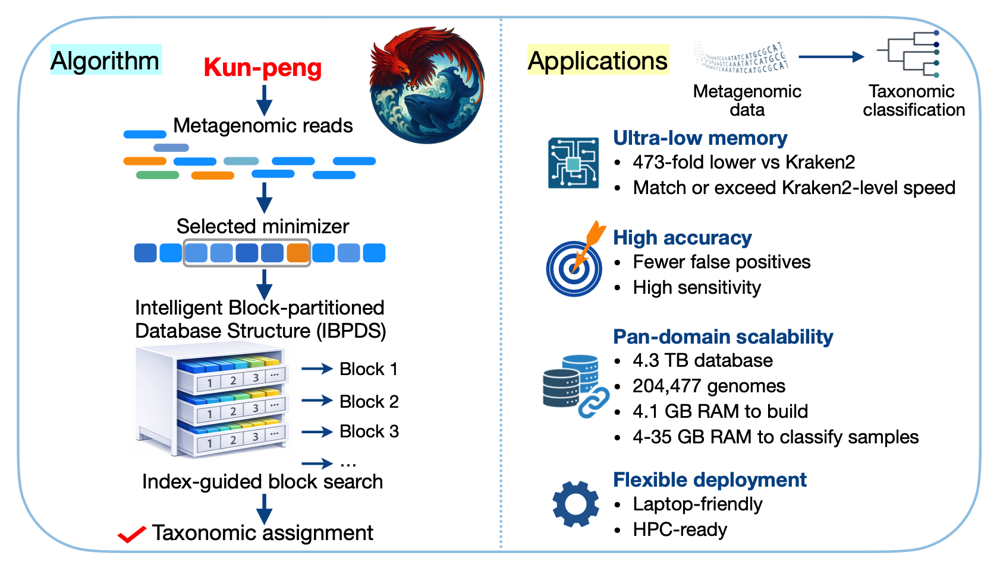

# Kun-peng 

[](https://doi.org/10.1093/bib/bbag119)
[](https://github.com/eric9n/Kun-peng/releases)



Kun-peng is a metagenomic classifier designed for large reference collections. It keeps memory usage practical by splitting the database into hash shards and loading only the shards needed for the current reads.

The project follows Kraken-style taxonomy assignment while optimizing storage layout, streaming, and I/O behavior for much larger databases.

## Why Kun-peng

- Sharded hash tables keep peak RAM in the single-digit GB range for many workflows.
- Large reference libraries can be built once and reused across many classification runs.
- Outputs are compatible with Kraken-style reports and downstream tooling.
- The pipeline can run end-to-end or as separate build/classification steps for debugging and benchmarking.

## Workflow Overview

Database build:

1. Prepare a reference library from NCBI downloads or your own FASTA files.
2. Estimate capacity and split minimizers into chunk files.
3. Build `hash_*.k2d`, `hash_config.k2d`, `taxo.k2d`, and `opts.k2d`.

Classification:

1. `splitr` chunks the input reads.
2. `annotate` loads only the required hash shards.
3. `resolve` computes taxonomy assignments and reports results.

## Install

### Option 1: Homebrew (macOS)

```bash
brew install eric9n/tap/kun_peng
```

### Option 2: Pre-built binaries

Download a release for Linux, macOS, or Windows from:

- https://github.com/eric9n/Kun-peng/releases

Then make sure `kun_peng` is on your `PATH`.

### Option 3: Build from source

Requirements:

- Rust toolchain

Build:

```bash
cargo build --release
```

The binary will be available at:

```text
./target/release/kun_peng
```

Verify installation:

```bash
kun_peng --version
```

## Quick Start

Choose the path that matches your situation.

### A. Build from downloaded genomes, then classify

```bash
kun_peng build --download-dir data/ --db test_database --hash-capacity 1G

mkdir -p temp_chunk test_out
kun_peng classify \
  --db test_database \
  --chunk-dir temp_chunk \
  --output-dir test_out \
  data/COVID_19.fa
```

Use this when `data/` already contains the taxonomy/genome downloads needed for the build.

Detailed guide:

- [docs/build-db-demo.md](docs/build-db-demo.md)
- [docs/classify-demo.md](docs/classify-demo.md)

### B. You already have a library or want to add your own FASTA files

Prepare the library:

```bash
kun_peng merge-fna --download-dir data/ --db test_database
```

or:

```bash
kun_peng add-library --db test_database -i /path/to/fastas
```

Then build and classify:

```bash
kun_peng build-db --db test_database --hash-capacity 1G

mkdir -p temp_chunk test_out
kun_peng classify \
  --db test_database \
  --chunk-dir temp_chunk \
  --output-dir test_out \
  data/COVID_19.fa
```

Detailed guide:

- [docs/build-db-demo.md](docs/build-db-demo.md)
- [docs/classify-demo.md](docs/classify-demo.md)

### C. You already have a Kraken 2 database

Convert the Kraken 2 database into Kun-peng's sharded format:

```bash
kun_peng hashshard --db /path/to/kraken_db --hash-capacity 1G
```

Then classify:

```bash
mkdir -p temp_chunk test_out
kun_peng classify \
  --db /path/to/kraken_db \
  --chunk-dir temp_chunk \
  --output-dir test_out \
  data/COVID_19.fa
```

If you have enough RAM to load all `hash_*.k2d` files at once:

```bash
bash cal_memory.sh /path/to/kraken_db
kun_peng direct --db /path/to/kraken_db data/COVID_19.fa
```

Detailed guide:

- [docs/hashshard-demo.md](docs/hashshard-demo.md)
- [docs/classify-demo.md](docs/classify-demo.md)

## Key Commands

Kun-peng exposes both end-to-end and stepwise subcommands:

- `build`: full build pipeline from downloaded data
- `build-db`: build database artifacts from an existing library
- `merge-fna`: normalize downloaded genomes into library files
- `add-library`: add local FASTA files into a database library
- `hashshard`: convert a Kraken 2 database into sharded Kun-peng format
- `classify`: integrated chunk-based classification workflow
- `direct`: load all hash tables for high-memory, high-speed classification
- `splitr`, `annotate`, `resolve`: stepwise classification pipeline

For command details:

```bash
kun_peng --help
kun_peng <subcommand> --help
```

## Inputs and Outputs

Inputs:

- FASTA / FASTQ
- Gzipped FASTA / FASTQ
- Multiple input files in one command
- A single `.txt` file listing input paths for `classify`

Main outputs from `classify`:

- `output_*.txt`: Kraken-style per-read classification output
- `*.kreport2`: hierarchical taxonomy summary

Example:

```bash
mkdir -p temp_chunk test_out
kun_peng classify --db test_database --chunk-dir temp_chunk --output-dir test_out data/COVID_19.fa
```

## Resource Notes

- `--hash-capacity` controls the number of slots per shard. As a rule of thumb, `1G` capacity produces about a 4 GiB shard file.
- Smaller shard sizes can reduce per-file memory pressure and improve I/O flexibility, at the cost of more files.
- `direct` mode requires RAM roughly equal to the total size of all `hash_*.k2d` files.
- `classify` uses much less memory because it loads shards on demand.

To estimate memory for direct mode:

```bash
bash cal_memory.sh test_database
```

## Common Pitfalls

- Use a clean `--chunk-dir` for `classify`. Leftover `sample_*.k2`, `sample_id*.map`, or `sample_*.bin` files will cause an error.
- After `add-library`, always rerun `build-db`. Old `hash_*.k2d` files will not match the updated library.
- `hashshard` stops if `hash_config.k2d` already exists in the target directory. Use a fresh directory or back up the old file first.
- If direct mode needs too much RAM, switch to `classify`.

## Docs

- [docs/cli-reference.md](docs/cli-reference.md): command reference by workflow
- [docs/build-db-demo.md](docs/build-db-demo.md): build a database from downloads or local FASTA
- [docs/classify-demo.md](docs/classify-demo.md): integrated and direct classification workflows
- [docs/hashshard-demo.md](docs/hashshard-demo.md): convert a Kraken 2 database
- [examples/README.md](examples/README.md): runnable Rust examples

## Development

Enable the repository Git hooks:

```bash
git config core.hooksPath .githooks
```

The provided `pre-push` hook runs:

```bash
cargo check --locked
```

## Citation

```bibtex
@article{Chen2026KunPeng,
  author = {Chen, Qiong and Zhang, Boliang and Peng, Chen and Huang, Jiajun and Liu, Zhen and Shen, Xiaotao and Jiang, Chao},
  title = {Kun-peng enables scalable and accurate pan-domain metagenomic classification},
  journal = {Briefings in Bioinformatics},
  volume = {27},
  number = {2},
  year = {2026},
  month = mar,
  doi = {10.1093/bib/bbag119},
  url = {https://academic.oup.com/bib/article/27/2/bbag119/8525000},
  publisher = {Oxford University Press}
}
```
